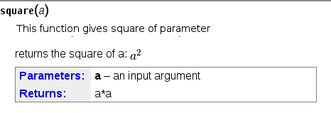
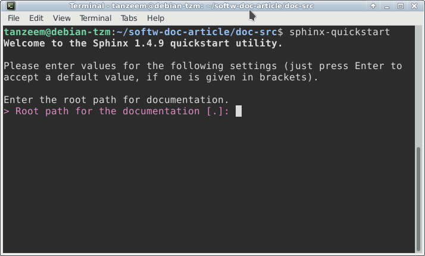
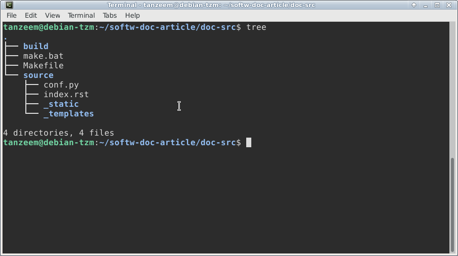

=====================================================
Documentation Tools and Techniques with Free Software 
=====================================================

Introduction
============

Documentation is an integral part of any effective system though it is sometimes neglected by many developers. This article discusses on the markup languages for writing documentation,tools used for writing the documentation, conversion from one format to other
hosting and versioning of documents.We will focus on markdown,reST and the tools for building the documents written using this.Though many technical writers prefers LaTex,since it is a high-quality typesetting system which includes features designed for the production of technical and scientific documentation.markdown and reST are programmers' choice with many tools like Pandoc,Sphinx and ReadTheDocs that assist in conversion, building,versioning and hosting the documents. LibreOffice is the choice of document writers who are usually not from a programming background and is a tool known for ease of use and a tool for everyone.

Markdown
========

Markdown is a text format documentation language which can be used to easily document software and systems developed with the key design goal of readability developed by John Gruber and Aaron Swartz. Modern editors like Vi, Atom, VScode and web based versioning systems like GitLab and GitHub support markdown. **Typora** is a markdown editor with live preview functionality. README.md file included in the source code of various free software
is written in this lightweight markdown format.

Markdown support for GNU Emacs can be enabled by using the following command in Debian based systems

`sudo apt-get install elpa-markdown-mode`

Markdown syntax
---------------

Using # we can create headings, eg #Welcome is equivalent to <h1>Welcome</h1> in HTML
Likewise we can create subheadings H2,H3 etc using ## and ### .
Alternatively  H1 and H2, can also be written as

::

 Heading1
 ========

 Heading2
 --------

To create paragraphs, use a blank lines to separate one or more lines of text. Also make sure that you do not indent paragraphs with spaces or tabs.

To create a line break ( ), end a line with two or more spaces, and then type return.

Giving emphasis to text can be done using \*text\* or \_text\_ for italics and ``**text**`` or `` __text__`` for making a text in bold emphasis.

To get a text in bold italics embed the text with tree *'s or _. eg ___text___ or ***text***

Blockquotes can be created using the following syntax in markdown

::

> This is a blockquote.
> 
> This is the second paragraph in the blockquote.
>
> ## This is an H2 in a blockquote

Lists in markdown can be generated in multiple ways. Using `*`, `-` or numbered lists using `#`.

Syntax::

    * This is a list
    * This is a another list
       * This is a sublist
       * This is another sublist

\* can be replaced with \- or \+ to create unordered lists and sublists

Simple ordered lists can be created with the following syntax(lines should start with the \*)::

    #. List item 1
    #. List item 2
    #. List item 3

Ordered lists with sublists can be created with the following syntax though there
is a limitation with sublists which is not fully supported. You need to have a line before each sublist with a leading tab before the sublist.

Syntax::

    1.Item1

      1.1 Item 1.1
    
       1.2 Item 1.2
    
    2.Item2

    3.Item3
     

To create simple links, you can simply place a URL or email address inside angle brackets:

eg; <https://www.gnu.org/software/emacs/> and
<bug-gnu-emacs@gnu.org>
   
Inline style links can be created using Markdown easily with the following syntax

Search freely with [DuckDuckGo](https://duckduckgo.com)

and optionally use a title with the following syntax

Search freely with [Duckduckgo](https://duckduckgo.com "Title")

Reference-style links allow you to refer to your links by names, which you define elsewhere in your document using the following syntax

Free Software Editors like [GNU Emacs][1], [Vim][2] ,and [Typora][3] provide support to Markdown.

[1]: https://www.gnu.org/software/emacs/ "Emacs"

[2]: https://www.vim.org/ "Vi Improved Editer"

[3]: https://typora.io/  "Markdown Live Previewer"

Image syntax is very much like link syntax.

There is a reference style for images also. 

![alt text][id]

[id]: /path/to/img.jpg "Title"

Codes can be created by wrapping paragraphs in backtick quotes.Any ampersands (&) and angle brackets (< or >) will automatically be translated into HTML entities.

Code blocks in Markdown are formatted by prefixing each line with four spaces, eg;:

    #include <stdio.h>
    
    int main()
    
    {
    
        printf("hello, world\\n");
        
        return 0;
        
    }

Horizontal rules, corresponding to 
 tags in HTML, are created in Markdown by placing three or more hyphens, asterisks, or underscores on a line by themselves. 

``---``

``- - -``

``* * *``

``________________________________________``

GitHub Flavored Markdown is a dialect of Markdown developed for use on GitHub.
It has support for Tasklists, Fenced code blocks and markdown preview

A sample task list 

- [ ] Incomplete task
- [x] Completed task

Table of contents can be generated in markdown by a list of the headings with each ToC entry in the following syntax. 

- [Introduction](#introduction)

where Introduction being an existing entry in the markdown document starting
with 

## Introduction.

A utility like `markdown-pdf` installed using `npm install markdown-pdf` can be used to convert markdwown to pdf. Pandoc can be used for conversion from markdown to various other formats.
  
reStructuredText
=================

reStructuredText or rest is another documentation language which is part of the python docutils package developed by David Goodger.
It is useful for in-line program documentation (such as Python docstrings), for quickly creating simple web pages, and for standalone documents. reStructuredText is designed for extensibility for specific application domains. The reStructuredText parser is a component of Docutils. reST is used to write technical documentation, books and websites. reST is supported by default by Emacs with syntax highlighting, or else it can be enabled by typeing `M-x rst-mode`. Vi, VSCode also support syntax highlighting for reST. Retext is a text editor with support for both md and reST with live preview functionality. Retext can be installed in Debian based systems with the command `sudo apt -y install retext`.
Additional functionality to rest is provided by the Sphinx documentation utility. Sphinx is a tool that makes it easy to create intelligent and beautiful documentation from reStructuredText. The documents written in rest have the extension .rst or .rest.

When you write documentation in reST, you need to be very precise and stick to some strict rules:

- RST syntax, like Python is sensitive to indentation, you should be aware when to indent and when not to
- RST requires blank lines between paragraphs

Prerequisites:
--------------

reStructuredText is a technology created by Python community, so most of the toolchain is built upon Python. It is very important to install Python version 3.4 or above in advance. 
Docutils can be installed by using the following command in Linux::

pip install docutils

There are several tools that come with this package which is used to convert rst files to various other formats.

::

  rst2html            rst2man             rst2pseudoxml
  rst2html4           rst2odt             rst2s5
  rst2html5           rst2odt_prepstyles  rst2xetex
  rst2latex           rst2pdf             rst2xml

Sphinx which is built on top of docutils and intended for larger projects adds even more functionality and can be used to create very professional looking documents.

Sphinx can be installed by running the following command from the terminal:: 

pip install sphinx sphinx-autobuild

Titles in reST
--------------

Titles are underlined (or over- and underlined) with a nonalphabatic character
atleast as long as the text.
A lone top-level section is lifted up to be the document's title.
Any non-alphanumeric character can be used, but Python convention is:

* ``#`` with overline, for parts
* ``*`` with overline, for chapters
* ``=`` for sections (for Heading1)
* ``-`` for subsections (for Heading2)
* ``^`` for subsubsections (for Heading3)
* ``"`` for paragraphs (for Heading4)

Blocks in reST
--------------

The most basic block in a reST document is Paragraph which can be created by giving one or more blanks lines before the text to be paragraphed.

Inline markup in reST is same as in markdown.

    one asterisk: \*text\* for emphasis (italics),

    two asterisks: ``**text**`` for strong emphasis (boldface), and

    backquotes: \``text`` for code samples.

Line blocks are a way of preserving line breaks:
eg ::

| These lines are
| broken exactly like in
| the source file.

Doctest blocks are interactive Python sessions. They begin with "``>>>``"
and end with a blank line.eg:

>>> print "This is a doctest block"
This is a doctest block.

Lists in reST
-------------
    
Lists of items come in three main flavours: enumerated, bulleted and definitions. In all list cases, you may have as many paragraphs, sublists, etc. as you want, as long as the left-hand side of the paragraph or whatever aligns with the first line of text in the list item.

All of the following forms are recognised:

1. numbers

A. upper-case letters
   and it goes over many lines

   with two paragraphs and all!

a. lower-case letters

   3. with a sub-list starting at a different number
   4. make sure the numbers are in the correct sequence though!

I. upper-case roman numerals

i. lower-case roman numerals

(1) numbers again

1) and again

#. This is a numbered list.
#. It has two items too.

Definition Lists can be created in the following format:

The format of a definition list is:

what
  Definition lists associate a term with a definition.

*how*
  The term is a one-line phrase, and the definition is one or more
  paragraphs or body elements, indented relative to the term.
  Blank lines are not allowed between term and definition.

Metadata like information about Author, Version, Dedication can be written
in the following syntax.
::

 :Authors:
   David Goodger
   and pals

 :Version: 1.0 of 2019/12/01

 :Dedication: To all free software folks

Tables in reST
--------------

There are two syntaxes for tables in reStructuredText. Grid tables are complete
but cumbersome to create. Simple tables are easy to create but with limited
functionality(no row spans etc.)

Grid table example::

  +------------+------------+-----------+
  | Header 1   | Header 2   | Header 3  |
  +============+============+===========+
  | body row 1 | column 2   | column 3  |
  +------------+------------+-----------+
  | body row 2 | Cells may span columns.|
  +------------+------------+-----------+
  | body row 3 | Cells may  | - Cells   |
  +------------+ span rows. | - contain |
  | body row 4 |            | - blocks. |
  +------------+------------+-----------+

Result:

+------------+------------+-----------+
| Header 1   | Header 2   | Header 3  |
+============+============+===========+
| body row 1 | column 2   | column 3  |
+------------+------------+-----------+
| body row 2 | Cells may span columns.|
+------------+------------+-----------+
| body row 3 | Cells may  | - Cells   |
+------------+ span rows. | - contain |
| body row 4 |            | - blocks. |
+------------+------------+-----------+

Simple table: Example::

  =====  =====  ======
   Inputs     Output
   ------------  ------
  A      B    A or B
  =====  =====  ======
  False  False  False
  True   False  True
  False  True   True
  True   True   True
  =====  =====  ======

Result:
  
=====  =====  ======
   Inputs     Output
------------  ------
  A      B    A or B
=====  =====  ======
False  False  False
True   False  True
=====  =====  ======

Comments in reST
----------------

::

 .. This is a comment
 ..
   _so: is this!
 ..
   [and] this!
 ..
   this:: too!
 ..
   |even| this:: !

reST Directives
---------------

Directives are an extension mechanism for reStructuredText, a way of adding support for new constructs without adding new primary syntax. 

Directives begin with an explicit markup start (two periods and a space), followed by the directive type and two colons (collectively, the "directive marker"). The directive block begins immediately after the directive marker, and includes all subsequent indented lines. The directive block is divided into arguments, options (a field list), and content (in that order), any of which may appear.

As an example,consider the code-block syntax. It allows to insert code (here HTML) within your document.::

.. code-block:: html
    
    <h1>code block example</h1>

Similarly using directives we can create table with the usage of CSV-like syntax                                                                                                                                                                   

Example::

    .. csv-table:: a title
	:header: "name", "firstname", "age"
	:widths: 20, 20, 10

	"Smith", "John", 40
	"Smith", "John, Junior", 20 

this is rendered as follows:

.. csv-table:: a title
	:header: "name", "firstname", "age"
	:widths: 20, 20, 10

	"Smith", "John", 40
	"Smith", "John, Junior", 20 

Images can be included in a reST file like for example

::

    .. image:: picture.jpeg
       :height: 100px
       :width: 200 px
       :scale: 50 %
       :alt: alternate text
       :align: right

Images are a common use for substitution references as in the example:

::

* |Red light| means stop.
* |Green light| means go.
* |Yellow light| means go really fast.

::

.. |Red light|    image:: red_light.png
.. |Green light|  image:: green_light.png
.. |Yellow light| image:: yellow_light.png

A "figure" consists of image data (including image options), an optional caption (a single paragraph), and an optional legend (arbitrary body elements). For page-based output media, figures might float to a different position if this helps the page layout.

::

    .. figure:: picture.png
       :scale: 50 %
       :alt: alternet text here
        This is the caption of the figure (a simple paragraph).

        This portion consists of all elements after the caption.

The "topic" directive is used to create a topic element.

::

  .. topic:: Title

   Body

The "contents" directive generates a table of contents (TOC) in a topic. Topics, and therefore tables of contents, may occur anywhere a section or transition may occur. Body elements and topics may not contain tables of contents.

Here's the directive in its simplest form:
::

.. contents::

An explicit title may be specified with the syntax::

.. contents:: Table of Contents

Most commonly used option for contents directive is "depth". The number of section levels that are collected in the table of contents. The default is unlimited depth. The syntax is
::

 .. contents:: Table of Contents
   :depth: 2

Explicit markup in reST
-----------------------

Explicit markup blocks are used for constructs which float (footnotes), have no direct paper-document representation (hyperlink targets, comments), or require specialized processing (directives). They begin with two periods and whitespace, the "explicit markup start". 

Footnote references, like ``[5]_.``
Note that footnotes may get
rearranged, e.g., to the bottom of
the "page".

``.. [5]`` A numerical footnote. Note
   there's no colon after the ``]``.

Result:

Footnote references, like [5]_.
Note that footnotes may get
rearranged, e.g., to the bottom of
the "page".

.. [5] A numerical footnote. Note
   there's no colon after the ``]``. 

----

   
Autonumbered footnotes are
possible, like using ``[#]_`` and ``[#]_``.
Then the footnotes can be created by

``.. [#]`` This is the first one.

``.. [#]`` This is the second one.

This will be rendered as: 

[#]_ and [#]_

.. [#] This is the first one.
.. [#] This is the second one.

They may be assigned 'autonumber labels' - for instance, ``[#fourth]_`` and ``[#third]_``.

``.. [#third]`` a.k.a. ``third_``

``.. [#fourth]`` a.k.a. ``fourth_`` 

Result:

They may be assigned 'autonumber labels' - for instance, [#fourth]_ and [#third]_.

.. [#third] a.k.a. third_

.. [#fourth] a.k.a. fourth_ 

Auto-symbol footnotes are also
possible, like this: ``[*]_`` and ``[*]_``.

``.. [*]`` This is the first one.

``.. [*]`` This is the second one. 

Result:

Auto-symbol footnotes are also
possible, like this: [*]_ and [*]_.

.. [*] This is the first one.
.. [*] This is the second one. 

Citations can also be created with restructured text.Citation labels are case-insensitive and contain alphanumerics, underlines, hyphens and fullstops.

Example:
Refer to citation [CIT101]_. Note that citations may get rearranged, e.g., to the bottom of the "page".

.. [CIT101] This is the citation.  It's just like a footnote,
   except the label is textual.

Hyperlinks in reST
------------------

There are three type of links :

1.External links (http-like)

2.Implicit links to title

3.Explicit links to user-defined label (e.g., to refer to external titles).

External Hyperlinks
^^^^^^^^^^^^^^^^^^^
If you want to create a link to a website, the syntax is
 \`<http://www.python.org/>\`_
 
which will appear as `<http://www.python.org/>`_

Labeled hyperlinks can be created; eg like in \`Python <http://www.python.org/>\`_
which will be rendered as `Python <http://www.python.org/>`_

Implicit Hyperlinks to Titles
^^^^^^^^^^^^^^^^^^^^^^^^^^^^^
Titles are considered as hyperlinks in reST. A link to a title is just its name within quotes and a final underscore:
::

`Internal and External links`_

Explicit Links
^^^^^^^^^^^^^^
You can create explicit links within your RST files. For instance, this document has a label at the top called rst_tutorial, which is specified by typing:
::

.. _rst_tutorial:

You can refer to this label using two different methods. The first one is:
::

 rst_tutorial_

The second method use the ref role as follows: 
::

:ref:`rst_tutorial`

Directives like sidebar, header and footer, math are also useful.

More directives can be found at http://docutils.sourceforge.net/docs/ref/rst/directives.html.

Editor Support for reST
-----------------------

Vim 
^^^
Vim provides default reStructuredText syntax highlighting mode. There are plugins for vim 
for additional features like syntax highlighting and live preview.

- VST (Vim reStructured Text) is a plugin for Vim7 with folding for reStructuredText
- Riv.vim - fresh vim plugin for authoring rst and Sphinx doc
- Previm: Vim plugin for live previewing of reStructuredText and other mark up documents

VST plugin can be downloaded from http://skawina.eu.org/mikolaj/vst.zip
unzip vst to `~/.vim`.To use just do `:source vst.vim`

Another option is to use Riv.vim by downloading the zip file from https://github.com/gu-fan/riv.vim and unzip to ~/.vim

To use the Previm plugin, see  https://github.com/previm/previm/blob/master/README-en.mkd

GNU Emacs
^^^^^^^^^
The Emacs support via `rst-mode` comes as part of the Docutils package under `/docutils/tools/editors/emacs/rst.el`

Dedicated reST Editors
----------------------

ReText
^^^^^^
ReText a cross platform program written in Python that works like Marked. ReText is simple and powerful with support for markdown and reST with live preview feature. This works in all GNU/Linux and other POSIX compatible systems.This is available at https://github.com/retext-project/retext. This article itself was written using reST with the ReText editor mostly,
and GNU Emacs also.

RSTPad
^^^^^^

RSTPad is another Standalone reStructuredText editor with live preview. This is available from https://github.com/ShiraNai7/rstpad

Rest Implementations
--------------------

Although the reference implementation of reStructuredText is written in Python, there are
reStructuredText parsers in other languages too in addtion to Python Docutils

- Pandoc
- Parsers for Java, PHP, C#/.NET
- Sphinx Extension

Pandoc
======

Pandoc is a Haskell library for converting from one markup format to another, and a command-line tool that uses this library. It can read Markdown and (subsets of) reStructuredText, HTML, and LaTeX, and it can write Markdown, reStructuredText, HTML, LaTeX, ConTeXt, PDF, RTF, DocBook XML, OpenDocument XML, ODT, GNU Texinfo, MediaWiki markup, groff man pages, and S5 HTML slide shows.

Pandoc can take the following input formats for conversion

Documents in (several dialects of) Markdown, reStructuredText, textile,
HTML, DocBook, LaTeX, MediaWiki markup, TWiki markup, TikiWiki markup, Creole 1.0,
Vimwiki markup, OPML, Emacs Org-Mode, Emacs Muse, txt2tags, Microsoft Word docx,
LibreOffice ODT, EPUB, or Haddock markup

Pandoc can produce the following output formats

HTML formats (XHTML, HTML5, and HTML slide shows using Slidy, reveal.js, Slideous, S5,
or DZSlides)
Word processor formats (Microsoft Word docx, OpenOffice/LibreOffice ODT, OpenDocument
XML, Microsoft PowerPoint.)
Ebooks (EPUB version 2 or 3, FictionBook2), Documentation formats (DocBook version 4 or
5, TEI Simple, GNU TexInfo, Groff man, Groff ms, Haddock markup), JATS, InDesign ICML,
OPML, LaTeX, ConTeXt, LaTeX Beamer slides, PDF, Lightweight markup formats
(Markdown (including CommonMark and GitHub-flavored Markdown), reStructuredText,
AsciiDoc, Emacs Org-Mode, Emacs Muse, Textile, txt2tags, MediaWiki markup, DokuWiki
markup, TikiWiki markup, TWiki markup, Vimwiki markup, and ZimWiki markup.)

The format of the input and output can be specified explicitly using command-line options.
The input format can be specified using the -f/--from option, the output format using the
-t/--to option. 

Thus, to convert hello.txt from Markdown to LaTeX, you could type:
::

 pandoc -f markdown -t latex hello.txt

To convert to reST the following command can be used::

 pandoc -s -t rst --toc MANUAL.txt -o example6.text

Laika- a reST implementation in Scala
-------------------------------------

Laika is a new library for transforming markup languages to other output formats. The library is written in Scala but should be also usable from Java. Support for Markdown (incl. GitHub Flavored Markdown) and reStructuredText as input and HTML, EPUB, PDF, XSL-FO and AST (for debugging) as output.

reST implementation in Perl
---------------------------

`Text::Restructured` - Perl implementation of reStructuredText parser

`Dotiac::DTL::Addon::markup` - Filters to work with common markup languages - support reStructuredText

`Pod::POM::View::Restructured` - View for Pod::POM that outputs reStructuredText

Wiki programs like **MediaWiki** and **MoinMoin** provide support reST through extensions and parsers. The blogging framework **Wordpress** supports reST through a plugin.
The **Pelican** static site generator uses reST for writing blogs.

Sphinx
======

.. image:: sphinxheader.png
   :height: 100px
   :width: 200 px
   :scale: 50 %
   :alt: sphinx-image
   :align: left

The Sphinx documentation generator translates a set of reStructuredText source files into various output formats, automatically producing cross-references, indices etc.
Sphinx uses reStructuredText as its markup language, and many of its strengths come from the
power and straightforwardness of reStructuredText and its parsing and translating suite, the
Docutils.

There are some extensions provided to the reST directives by Sphinx, some of these are expalined below:

The toctree directive
---------------------

The toctree directive allows you to insert other files within a RST file.The toctree directive looks like ::

    .. toctree::
        :maxdepth: 2
        :numbered:  
        :titlesonly:
        :glob:
        :hidden:

        intro.rst
        chapter1.rst
        chapter2.rst

It includes 3 RST files and shows a TOC that includes the title found in the RST documents.

Here are a few notes about the different options

   + `maxdepth` is used to indicates the depth of the tree.
   + `numbered` adds relevant section numbers.
   + `titlesonly` adds only the main title of each document
   + `glob` can be used to indicate that * and ? characters are used to indicate patterns.
   + `hidden` hides the toctree. It can be used to include files that do not need to be shown (e.g. a bibliography).

Sphinx can be used to create generic documentation, or software documentation dedicated to Python, C, C++ etc.

Autodocument the Python code
----------------------------

Let us suppose you have a python file called sample.py with a function called square. The function’s code is :

::

    def square(a):
        """This functions produces a square of the parameter

         Returns the square of a: :math:`a^2`

        :param a: an input argument

        :returns: a*a
        """
        return a*a

Using the autofunction directive::

  .. currentmodule:: sample
  .. autofunction:: square

produces a documentation from the comments section of the python function definition.

Using the module directive also creates an index so it is worth specifying more information using platform and synopsis options for example:
::

 .. module:: sample
     :platform: Unix, Windows
     :synopsis: sample of documented python code

There are simple directives like seealso,notes and warnings that creates nice colored boxes:
::

 .. seealso:: This is a simple **seealso** note.

 .. note::  This is a **note** box.

 .. warning:: This generates a warning box

Create a new Sphinx Project
---------------------------

Once Sphinx is installed, you can call the sphinx-quickstart to generate a new project
with its own buildscript.

`sphinx-quickstart myproject`

It will prompt you for a project name and an author name, as well as many other questions. You can select all of the defaults if you are unsure.

After all the entries, based on my default entries the following directory structure will be produced.

Edit the `index.rst` and add other pages and subdirectories as needed. When you are done editing, you can `make/build` the project with the `make` command.

Build your documentation project
--------------------------------

Once the reStructuredText documents are ready, you call make in GNU/Linux or make.bat in Windows:

You can build the documents to various formats
::

 make html
 make singlehtml
 make epub
 make man
 make latex
 make text

 make doctest   # Run unit tests embedded in docstrings 
 make coverage  # Check documentation coverage of code

The documents that are built can be found in the build or _build directory

To find a set of documents generated using Sphinx, see http://www.sphinx-doc.org/en/master/examples.html

There is more in Sphinx than we discuss here. 

Visit http://www.sphinx-doc.org/en/master/contents.html to learn Sphinx well.

ReadtheDocs
-----------

Read the Docs simplifies software documentation by automating building, versioning, and hosting of your docs for you. 

Sign up and tell ReadTheDocs.org about your repository, and set up a webhook to automatically build and host your documentation any time there is a git push.

RTD can integrate version control systems GitHub, Bitbucket and GitLab.
They will host multiple versions of documentation, you can use their theme or custom themes, and it even makes PDF and ePub versions available.

More about RTD can be found at https://docs.readthedocs.io

